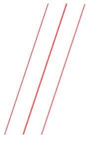
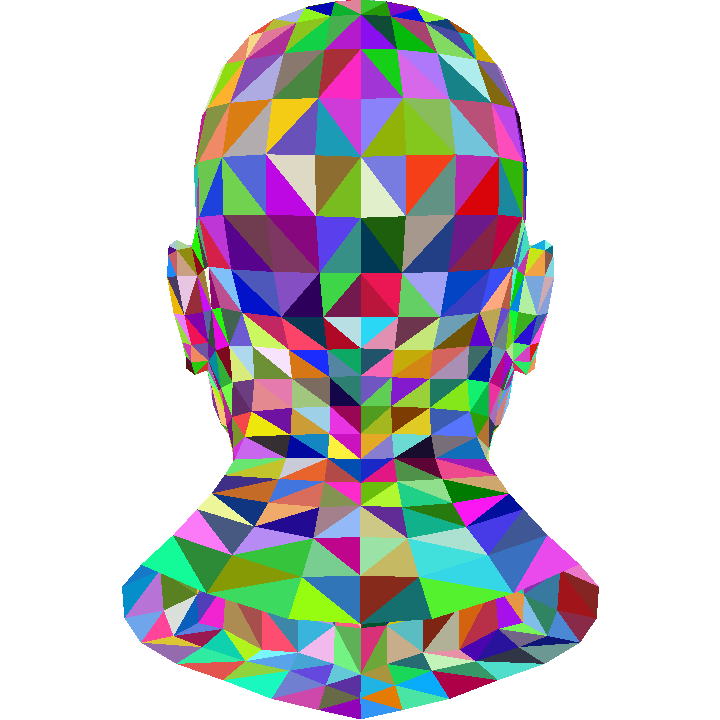
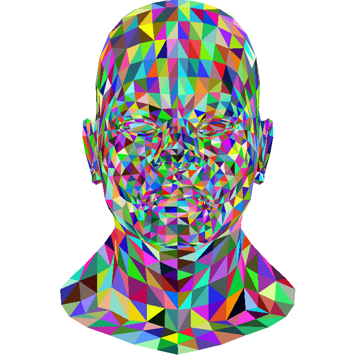
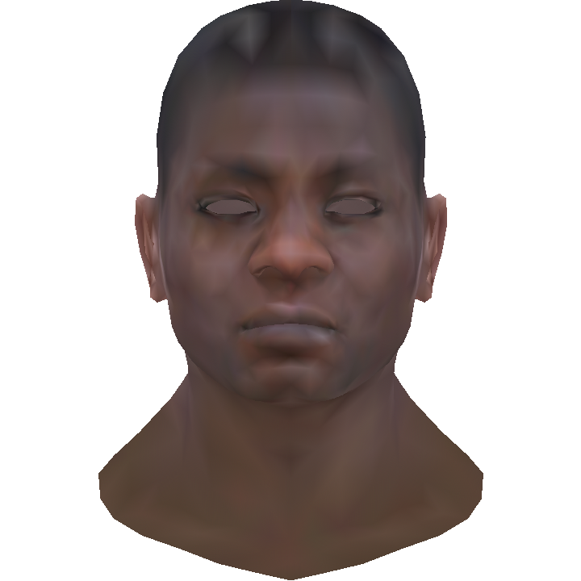
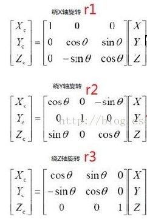

# SimpleRender

## 前言

* 在学完闫令琪老师的[games101](https://games-cn.org/intro-graphics/)课程后，为检验这段时间自己的学习成果，于是就准备自己尝试制作一个软光栅渲染器，顺便巩固一下学习成果
* 本项目同时参考了GitHub上的[tinyrender](https://github.com/ssloy/tinyrenderer)项目，来逐步完成渲染器的核心功能，同时帮助我查缺补漏
* 同时我也参考了相应的[知乎问答](https://www.zhihu.com/question/24786878)，对整个光栅渲染器的结构设计有了一个初步的想法
* 在实现本项目的技术选择上
  * 在我研究了一下Windows原生的桌面编程相关的API后，感觉太过繁琐，加上不想引入像QT这样比较重的库，因此我决定直接使用自己比较熟悉的HTML5的canvas作为渲染结果的展示平台，这样可以省去许多繁琐的工作
  * 同时，在本次项目中仅使用imageData来以像素为单位地直接操作canvas，从而避免使用canvas提供的相关绘制API
  * 在相关代码的编写上，我选择使用typescript来帮助我完成类型限制、优化编写类的体验，但为能够直接在文件系统中打开网页访问，我并没有采用模块化的方式将js代码导入HTML文件中，而是直接将所有ts文件编译成一个main.js文件再导入html文件中

## 准备工作

* 首先我要完成的就是实现与canvas的直接交互工作，对其进行封装，这样在之后的编写过程中就可以不再与canvas直接打交道了
* 根据习惯，我准备采用的是左下角为原点的坐标系，并定义了``Color``类，表示像素的RGB颜色，并在此基础上定义了存储``Color``的二维数组作为帧缓存``frame_buffer``
* 在研究了canvas所使用的``ImageData``格式之后，我完成了从``frame_buffer``到``ImageData``的映射工作（包括了将我使用的左下角为原点的坐标系转换为``ImageData``使用的左上角为原点的坐标系），并封装为``Frame``类的成员函数``showImage``，将帧缓存导入canvas并显示
* 这样准备工作就做好了，之后就不用再考虑有关canvas操作的相关问题了

## 1. 绘制线段

### Bresenham’s Line算法

* 首先要实现的就是在屏幕中画一条线，定义函数``drawLine(p1:Vector2,p2:Vector2,color:Color)``，其中``p1``和``p2``分别是线段的起点和终点

* Bresenham’s Line算法就不再阐述了，具体代码如下

  ```typescript
  drawLine(p1:Vector2,p2:Vector2,color:Color){
          let x1=Math.round(p1.x);
          let x2=Math.round(p2.x);
          let y1=Math.round(p1.y);
          let y2=Math.round(p2.y);
          let steep=false
          if(Math.abs(x1-x2)<Math.abs(y1-y2)){
              [x1,y1]=[y1,x1];
              [x2,y2]=[y2,x2];
              steep=true;
          }
          if(x1>x2){
              [x1,x2]=[x2,x1];
              [y1,y2]=[y2,y1];
          }
          let dx=Math.abs(x2-x1);
          let dy=Math.abs(y2-y1);
          let derr=dy*2;
          let dis=(y1<y2)?1:-1;
          let error=0;
          for(let x=x1,y=y1;x<=x2;++x){
              if(steep){
                  this.setPixel(x,y,color)
                  
              }else{
                  this.setPixel(y,x,color)
              }
              error+=derr;
              if(error>dx){
                  y+=dis;
                  error-=2*dx;
              }
          }
  
      }
  ```

### 反走样

* 采用Bresenham’s Line算法实现了绘制之后，我发现对于斜线段，锯齿感明显
* 因此需要进行反走样操作，这里我采用的是对线段周围的像素进行模糊操作
* 我使用的模糊操作比较简单，直接令相应像素与周围像素的颜色取平均值
* 以下从左到右依次是未采用反走样、采用反走样以及使用canvas自带绘制API得到的同一条直线
  

* 可以看到最左边的线段锯齿状明显，中间的线段虽不如右端，但比起左端效果明显变好，缺陷是由于我是对周围线段进行的反走样操作，线段变得较粗

## 2. 读取并解析OBJ文件

* 在完成了直线的绘制之后，tiny renderer教程提供了一个obj文件来检验当前的结果
* 在这里，我走了一定的弯路，起初我想一次性解析完整个obj文件格式并导成可供代码使用的对象，但始终不知道如何设计相关的数据结构，加上我自己对于直接使用JavaScript操作长字符串也不甚了解，浪费了很多时间
* 最后还是想明白了，先解析好目前要用数据，之后再迭代开发才能更好地设计出易用的结构
* 之后我在参考他人的代码上实现了对OBJ文件的解析
  * 由于JavaScript中字符串为值类型且每次修改都是进行复制操作，容易引发性能问题
  * 因此首先先将字符串按行划分成数组元素，每次仅对一行字符串进行操作，避免多次复制长字符串
  * 接着在每一行移除注释部分
  * 接着根据每行起始关键字执行相应的解析操作
  * 这里，虽然在网上的资料中得知obj文件支持使用\符号连接多行，但在此为了方便，我不考虑这一情况
* 最终，我将需要用到的顶点和面结构导入定义好的Model类中，并进行相应的绘制测试
* 通过绘制obj文件，我也发现了代码中之前存在的许多bug，并修复完成

## 3. 绘制三角形

* 对于一个三角形而言，根据其各顶点横纵坐标的最大最小值，即可构造出一个矩形，使得三角形位于矩形内部
* 对于构造出的矩形内部的每一个像素点而言，只需判断该像素点算法在三角形内部，若在，则向image填入相应像素颜色
* 这里我采用重心坐标（Barycentric Coordinates）来判断像素是否在三角形内部，若像素点在三角形内，则重心坐标$(α,β,γ)$需满足$(0<=α<=1),(0<=β<=1),(0<=γ<=1),(α+β+γ==1)$，因此若像素点不在三角形内，重心坐标$(α,β,γ)$至少有一个值会小于0（大于1）

## 4. Z-Buffer

* 接下来就是要解决三角形的重叠问题了，显然对于一个三维的图像来说，要显示在二维平面上，必然有部分图像会被其他图像重叠，显然，我们能看到的图像必然是离我们最近的图像
* 这里我们先假设我们是正对XOY平面的，且离屏幕无穷远，我们引入一个数组Z-Buffer，它的每一项与屏幕上的每一个像素点一一对应，对于像素点(x,y)来说，Z-Buffer保存的值就是横纵坐标为(x,y)的所有点中离我们最近的点的z值
* 这样我们在绘制三角形内的每一个像素点时，都要先比较对应z-buffer项的值，若离我们更近，则更新z-buffer以及图像对应像素的颜色
* 在增加了z-buffer后，再绘制tiny renderer教程中提供的人像模型，则绘制出以下图形
* 这里由于我按照习惯，继续采用左手坐标系，因此z值越小，则代表越近，因此与tiny render绘制的人像方向相反，这时，只需在传入三角形坐标时对z值取反，即可得到正面人像

## 5. 简单的纹理映射

* 由于之前一直是采用随机颜色来绘制三角形，视觉效果比较差，然后tiny renderer的第三节课也给了一个小作业，完成人像模型的纹理映射

* 这里我先假定纹理图片只有一张，具体流程即为

  1. 上传纹理图片文件
  2. 将图片文件转为```HTMLImageElement```对象
  3. 使用canvas提供的API将其转换为```ImageData```
  4. 再将```ImageData```转换为我所使用的```Color[][]```对象
  5. 根据获得的```Color[][]```对象构造出纹理类

* 接下来修改相应函数，使像素点的颜色不再使随机的

* 由于obj文件只提供了三角形顶点的纹理坐标，对于其他点，则采用插值的方式获取

* 这里我分别尝试了两种插值方式

  * 一种是对颜色的插值，先获取各顶点的颜色，再对颜色进行插值操作
  * 另一种是对纹理坐标的插值，对各顶点纹理坐标进行插值后再获取纹理颜色

* 最终两种方式的效果分别如下

  * 对颜色的插值

  

  * 对纹理坐标的插值

  

  

## 6. 矩阵变换与投影

### 矩阵变换

#### 旋转

  * 对于一个三维的坐标点来说，我们可以通过如下矩阵令该点绕某一个坐标轴旋转，当然想绕任意轴旋转也是可以做到的，不过旋转矩阵较为复杂，在本项目中，我仅令矩阵沿三个坐标轴进行旋转
    

    

#### 缩放

* 我们仅需使用一个对角阵就可以完成缩放操作，元素(i,i)就代表坐标的第i项的缩放比例

#### 平移

* 由于仅仅使用三维矩阵进行变换的话，我们无法完成平移操作

* 这里我们引入第四维w，并且我们有如下定义(x,y,z,1)和(xw,yw,zw,w)表示的是同一个坐标，即三维空间中的坐标(x,y,z)，这样我们就可以用一个四维向量来描述一个平移变换了

* 这里对于坐标(x,y,z,1)，我们若要获得坐标(x+a,y+b,z+c,1)，我们只需使用如下的平移矩阵即可
  $$
  \left[ \begin{matrix} 1 & 0 & 0 & a \\ 0 & 1 & 0 & b\\ 0 & 0 & 1 & c \\ 0 & 0 & 0 & 1 \end{matrix} \right]
  $$

#### 复杂变换

* 对于若干个矩阵变换$A_0,A_1,A_2...$，我们只需按照变换顺序依次左乘得到新的矩阵$B=...A_2A_1A_0$，即得到复杂变换B，效果等价于执行这若干个矩阵变换

#### 法向量变换

* 对于一个坐标点来说，执行完坐标变换后，不能保证原法向量仍与切向量垂直，因此我们得同时对法向量进行相应变换，设切向量为A，法向量为B，坐标点的变换矩阵为C，设B的变换矩阵为D，在对坐标点执行C变换后，显然切向量A就变换为CA
* 首先由定义可知$A^TB=0$，为保证变换后仍保证该性质，即$(CA)^T(DB)=AC^TDB=0$
* 因此我们令$D=(C^T)^{-1}$，即可使得$(CA)^T(DB)=0$

### 投影

* 为了将三维空间的点映射到二维平面中，我们就得对空间的每个坐标点进行投影操作

#### 正交投影

* 设$l<=x<=r,b<=y<=t,n<=z<=f$，为了方便之后的操作，我们需要进行一个简单的映射操作令$[l,r]\rightarrow[-1,1],[b,t]\rightarrow[-1,1],[n,f]\rightarrow[-1,1]$，变换矩阵即为
  $$
  \left[ \begin{matrix} \frac{2}{r-l} & 0 & 0 & 0 \\ 0 & \frac{2}{t-b} & 0 & 0\\ 0 & 0 & \frac{2}{f-n} & 0 \\ 0 & 0 & 0 & 1 \end{matrix} \right]
  \left[ \begin{matrix} 1 & 0 & 0 & -\frac{r+l}{2} \\ 0 & 1 & 0 & -\frac{t+b}{2}\\ 0 & 0 & 1 & -\frac{n+f}{2} \\ 0 & 0 & 0 & 1 \end{matrix} \right]
  $$
  
* 正交投影可视为在空间中使用平行光去照射物体，最终将得到的坐标将其映射到二维平面时，保持x轴和y轴坐标不变即可

#### 透视投影

* 透视投影则是符合人眼的视觉效果，近大远小

* 其主要思路是根据摄像机视场角（FOV）从摄像机投射出若干射线，形成视锥，根据预先设定好的最近可视距离（n）和最远可视距离（f），截取出可视的区域，将该区域压缩成一个标准正方体(canonical cube, $[-1,1]^3$)

* 设点的坐标为(x,y,z,1)，按照近大远小的思路，根据z轴对点进行压缩，即得到(nx/z,ny/z,?,1)，该点与(nx,ny,?,z)等价，同时，对于最近和最近的可视平面来说，其z值保持不变，同时考虑到对z轴变换时，仅与z相关与x，y轴无关，因此设z轴对应的变换为(0,0,A,B)即
  $$
  (0,0,A,B)(0,0,n,1)^T=(0,0,n^2,n)^T\\
  (0,0,A,B)(0,0,f,1)^T=(0,0,f^2,f)^T
  $$

* 得到$A=n+f,B=-nf$

* 最终可得到透视矩阵
  $$
  \left[ \begin{matrix} n & 0 & 0 & 0 \\ 0 & n & 0 & 0\\ 0 & 0 & n+f & -nf \\ 0 & 0 & 1 & 0 \end{matrix} \right]
  $$
  
* 最后将得到的矩阵执行一次正交投影操作，即可得到标准正方体

### 视口变换

* 为了将图像显示在屏幕上，我们还需对得到的标准正方体进行视口变换
* $令x=(x + 1) * width / 2,y=(y + 1) * height/ 2$，我们可以获得对应屏幕上的横纵坐标
* $通过f1=(f-n)/2,f2=(f+n)/2,z=z*f1+f2$，我们可以将z轴变换至视锥的可视范围内

## 7. Blinn Phong光照模型

* 之前我只实现了简单的纹理映射，在此基础上，添加光照，完成Blinn Phong光照，可使模型更具有真实感

* Blinn Phong模型是一个经验模型，它将光照分为漫反射光，镜面反射光和环境光照

* 推导过程在此我就不赘述了

* 由于本项目不支持使用mtl材质文件，仅支持使用单个纹理贴图，因此对于ka和ks，我直接参照了games101相关作业的参数

* 最终结果

  

## 8. 超采样抗锯齿（SSAA）

* 由于分辨率的问题，模型渲染结果仍存在较严重的锯齿现象
* 因此我又使用了SSAA来进行抗锯齿操作
* 先构造一个临时的帧缓存区，大小为```原始大小*对应的超采样倍率```，对```z_buffer```同样执行类似操作
* 最后再绘制的时候，任意的像素点的颜色为对应的若干个超采样像素点的颜色取平均值
* 运行结果对比
  
* 可以看到，使用ssaa算法的锯齿感明显低于未使用的情况

